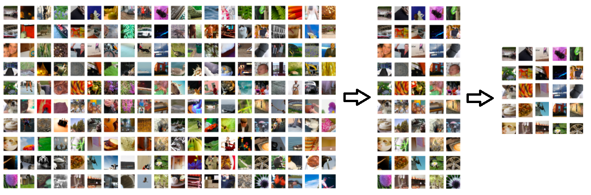

# ImageNet-Sampler

Create a subset of ImageNet (http://www.image-net.org/) dataset for rapid testing.

ImageNet dataset has 1000 classes of each ~1300 images. Training 1epoch of the resnet18 model with batch size 32 on NVIDIA RTX2080ti takes around 1:20h. If you want to check if your pipeline works fine in less than 5 minutes and you are not interested in training on the whole dataset,
 you can tell the tool: “I want a dataset with 50 classes with 500 images in each” and it will randomly create a subset of the images for you.

## Maping
Find the class maping (id to name) in the csv file.
